# 📊 Tableau — Data Analytics Portfolio

> **Week 2 of the Leep Talent Data Technician Skills Bootcamp (Level 3)**  
> This section showcases the Tableau skills I developed during the second week of my bootcamp, building interactive dashboards and visualisations across global health and music streaming datasets.  
> All dashboards are **published live on Tableau Public** — linked below each project.

---

## 📁 Contents

| Project | Dataset | Visuals |
|---------|---------|---------|
| [Project 1 — Global Health Insights](#-project-1--global-health-insights) | GapminderHealth | 4 worksheets + dashboard |
| [Project 1 — Extra Visualisations](#-project-1-extra--additional-visualisations) | GapminderHealth | 6 additional worksheets |
| [Project 2 — Spotify Music Trends](#-project-2--spotify-music-trends--popularity-analysis) | Spotify Features | 5 worksheets + dashboard |

---

## 🌍 Project 1 — Global Health Insights

**Dataset:** `GapminderHealth.xlsx`  
**File:** [`GapminderHealth.xlsx`](./GapminderHealth.xlsx)  
**Live Dashboard:** [🔗 View on Tableau Public](https://public.tableau.com/views/GlobalHealthInsights_17736829965910/GlobalHealthDashboard)

### About the Dataset

A global health dataset with approximately 6,000 records spanning multiple decades (1990–2008), covering countries across all major continents. Fields include Life Expectancy, BMI, Blood Pressure, Cholesterol, Lung/Liver/Stomach Cancer rates, Population, Population Growth, Gender, Country, Continent, and Year. The dataset is sourced via the Gapminder Foundation, which compiles public health data for research and education.

> **In my own words:** This dataset captures decades of health metrics across the globe, giving analysts the kind of multi-dimensional view that a public health organisation — like the NHS or WHO — would need to identify where to focus support, prevention, and resource allocation.

### Scenario

Working as a data analyst for a global health organisation, my team needed to quickly understand key health trends and disparities across countries and continents — particularly how life expectancy has changed over time and how it relates to other health indicators.

### Real-World Context

**Organisation type:** National health service, international health charity, or government health department (e.g. NHS, WHO, Public Health England)  
This kind of analysis helps health organisations identify underperforming regions, design targeted intervention programmes, and allocate funding where it will have the most impact on population health outcomes.

---

### Visual 1 — Life Expectancy by Continent

**Worksheet name:** `Life Expectancy by Continent`

Built a horizontal bar chart comparing average life expectancy across continents, sorted descending to surface the highest-performing regions immediately.

**What I did:**
- Dragged `Continent` to Rows and `Life Expectancy` to Columns
- Changed aggregation to Average
- Sorted by field (descending) to rank continents clearly
- Adjusted colours and labels for readability

**Screenshot**
> 📸 *In Tableau, navigate to the `Life Expectancy by Continent` worksheet. Capture the full chart showing all continents on the Y-axis and average life expectancy values on the X-axis, with the sort applied so the highest continent appears at the top. Colour formatting and axis labels should be visible.*

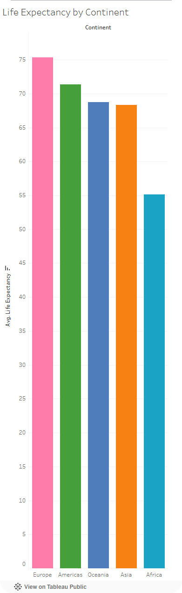

---

### Visual 2 — Life Expectancy Trend Over Time (Top 5 Countries)

**Worksheet name:** `Life Expectancy Trend`

Built a multi-line time series chart showing how life expectancy has changed over time for the top 5 countries by average life expectancy, with each country shown as a distinct colour.

**What I did:**
- Dragged `Year` to Columns and `Life Expectancy` to Rows (Average)
- Applied a Top N filter to `Country` — Top 5 by Average Life Expectancy
- Added `Country` to the Colour mark to differentiate lines
- Fixed the Y-axis range (Start: 70, End: 85) to remove whitespace and improve clarity
- Added data labels via the Labels section in the Marks card

**Screenshot**
> 📸 *Navigate to the `Life Expectancy Trend` worksheet. Capture the full line chart showing years on the X-axis (covering the full dataset range), average life expectancy on the Y-axis (scaled 70–85), and five distinct coloured lines — one per country. The legend showing which colour corresponds to which country must be visible on the right.*

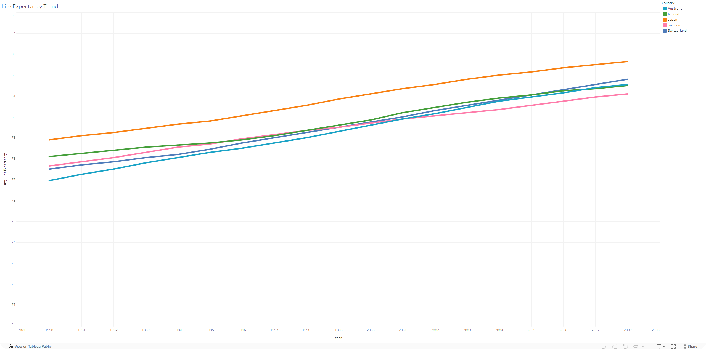

---

### Visual 3 — Population Distribution by Gender (Canada, 2008)

**Worksheet name:** `Population by Gender`

Built a pie chart showing the population split between male and female for Canada in 2008, with interactive filter controls for Country and Year.

**What I did:**
- Dragged `Gender` to Columns and `Population` to Rows to create a bar chart
- Converted to a Pie chart via the Show Me panel
- Added a `Country` filter, set to Canada, with the filter shown as a dropdown
- Added a `Year` filter, set to include from 2008 onwards
- Dragged `Population` to the Label mark to display values on each slice
- Resized the chart for visibility and readability on the dashboard

**Screenshot**
> 📸 *Navigate to the `Population by Gender` worksheet. Capture the pie chart showing two slices (male and female) with population figures displayed as labels on each slice. The Country filter (showing Canada) and Year filter (showing 2008) should be visible as interactive controls on the right side of the view.*

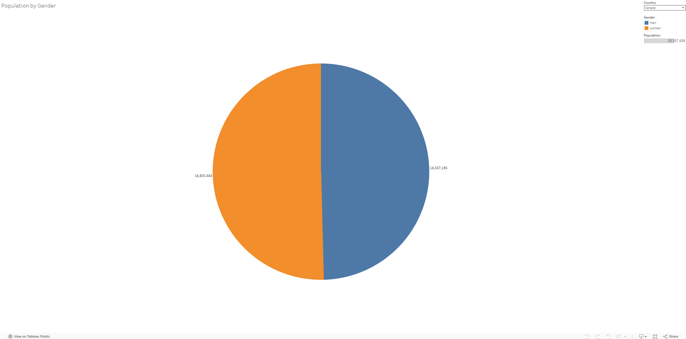

---

### Visual 4 — Life Expectancy vs BMI (Scatter Plot)

**Worksheet name:** `Life Expectancy vs BMI`

Built a scatter plot to explore the relationship between average life expectancy and average BMI across countries, with each point representing a country and coloured by continent.

**What I did:**
- Dragged `Life Expectancy` to Rows and `BMI` to Columns
- Added `Country` to the Detail mark — each dot represents one country
- Added `Continent` to the Colour mark to group countries visually
- Customised the axis ranges to centre the data (X: 500–1350, Y: 1000–3500)

**Screenshot**
> 📸 *Navigate to the `Life Expectancy vs BMI` worksheet. Capture the full scatter plot showing individual country dots across the chart area, with the Continent colour legend visible on the right. Both axis labels ("Life Expectancy" and "BMI") should be clearly readable. The spread of points across continents — particularly the clustering of African countries in the lower-left — should be visible.*

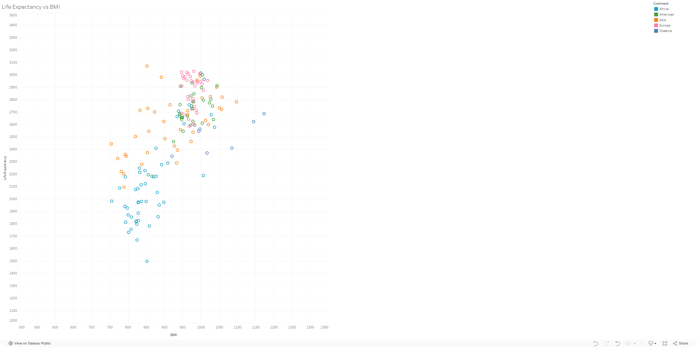

---

### Dashboard — Global Health Insights

**Dashboard name:** `Global Health Dashboard`

Combined all four worksheets into a single interactive dashboard, with the Continent colour filter repositioned to float beside the scatter plot, and the pie chart resized for balanced layout.

**Screenshot**
> 📸 *Navigate to the `Global Health Dashboard` tab. Capture the complete dashboard showing all four visuals arranged together — bar chart (top left or right), line chart (trend over time), pie chart (population by gender), and scatter plot. The floating Continent legend filter should be visible near the scatter plot. The dashboard title "Global Health Insights" should be readable at the top.*

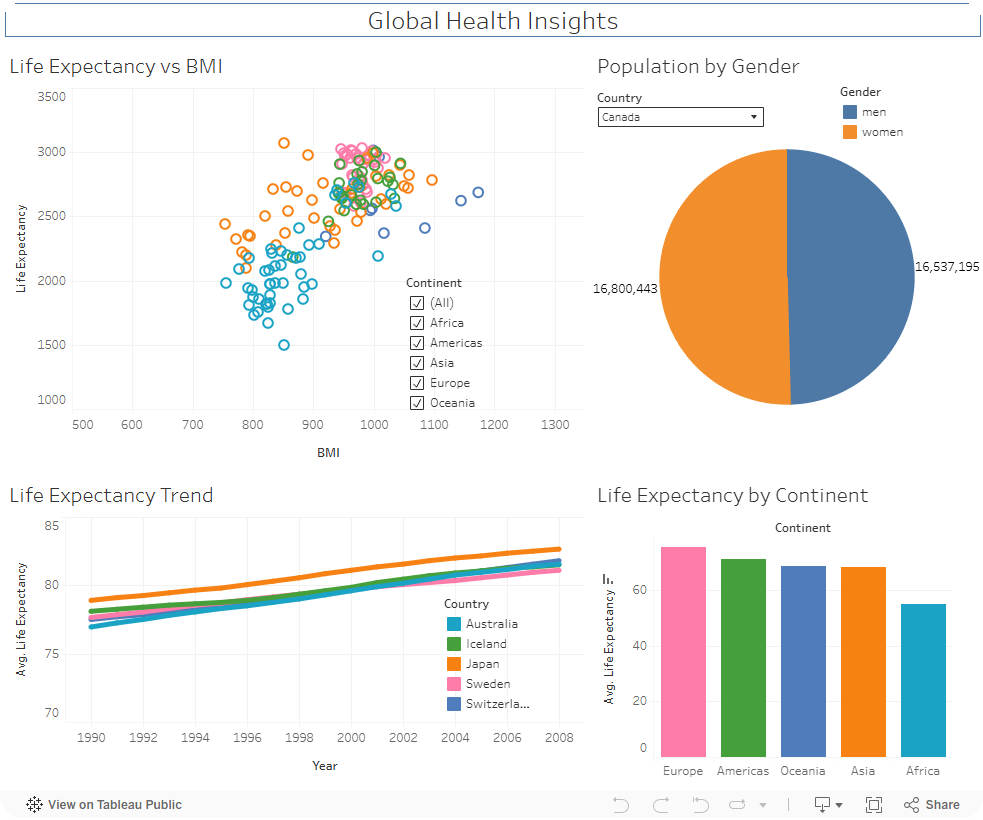

---

### Findings & Reflection

> *From the dashboard, I found that life expectancy is generally higher in Europe and some developed countries compared to other continents. The trend chart shows life expectancy has gradually increased over time across most countries. The scatter plot suggests a relationship between BMI and life expectancy — showing how lifestyle and health factors influence overall outcomes. The population by gender pie chart highlights roughly equal male/female splits, which can form the basis of further demographic analysis.*

**What this means for the NHS:**  
By analysing patterns such as BMI and life expectancy trends, the NHS could better understand where to focus health campaigns or prevention programmes. If certain health factors are linked to lower life expectancy in specific regions, early intervention strategies can be targeted where they will be most impactful.

**Live Dashboard:** [🔗 Global Health Dashboard on Tableau Public](https://public.tableau.com/views/GlobalHealthInsights_17736829965910/GlobalHealthDashboard)

---

## 🌍 Project 1 Extra — Additional Visualisations

These additional worksheets extend the GapminderHealth analysis with more advanced visual types and calculated fields, published alongside the main dashboard.

**Live Extra Visuals:**  
🔗 [Global Average BMI by Country](https://public.tableau.com/app/profile/chanveer.grewal/viz/GlobalHealthInsights_17736829965910/GlobalAverageBMIbyCountry)  
🔗 [Life Expectancy Trends by Continent](https://public.tableau.com/app/profile/chanveer.grewal/viz/GlobalHealthInsights_17736829965910/LifeExpectancyTrendsbyContinent)

---

### Extra Visual 1 — Global Average BMI by Country (Filled Map)

Built a filled choropleth map showing average BMI by country, using a red-blue diverging colour palette to make disparities immediately visible.

**What I did:**
- Set `Country` geographic role to Country/Region
- Double-clicked `Country` to auto-generate a map using Tableau's latitude/longitude
- Changed mark type to Filled Map
- Dragged `Life Expectancy` to Colour and changed aggregation to Average
- Applied a red-blue diverging stepped colour palette for clearer range distinctions

**Screenshot**
> 📸 *Navigate to the Global Average BMI map worksheet. Capture the full world map with countries filled in colour — darker shades indicating higher or lower life expectancy depending on your palette direction. The colour legend should be visible on the right, clearly showing the scale from lowest (one colour) to highest (contrasting colour). Country boundaries should be visible.*

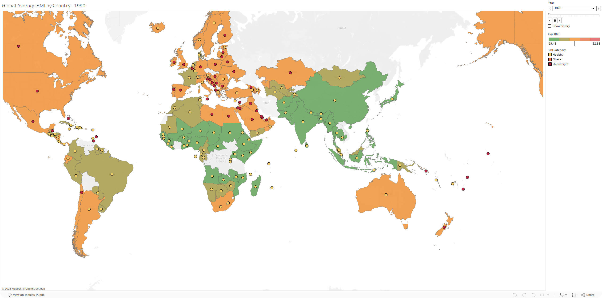

---

### Extra Visual 2 — Life Expectancy Trends by Continent (Bar Chart)

A stacked bar chart showing how life expectancy has evolved year by year across continents from 1990 to 2008, with each continent represented by a distinct colour.

**What I did:**
- Dragged `Year` to Columns and `Life Expectancy` to Rows (SUM)
- Changed mark type to Bar
- Dragged `Continent` to Colour
- Added `Life Expectancy` to Detail (set to Average) for more precise breakdown
- Adjusted the colour palette and bar width via the Size slider

**Screenshot**
> 📸 *Navigate to the Life Expectancy Trends by Continent worksheet. Capture the full bar chart showing years 1990–2008 on the X-axis and life expectancy values on the Y-axis. Each bar should be filled with stacked segments — one colour per continent. The Continent colour legend should be visible on the right.*

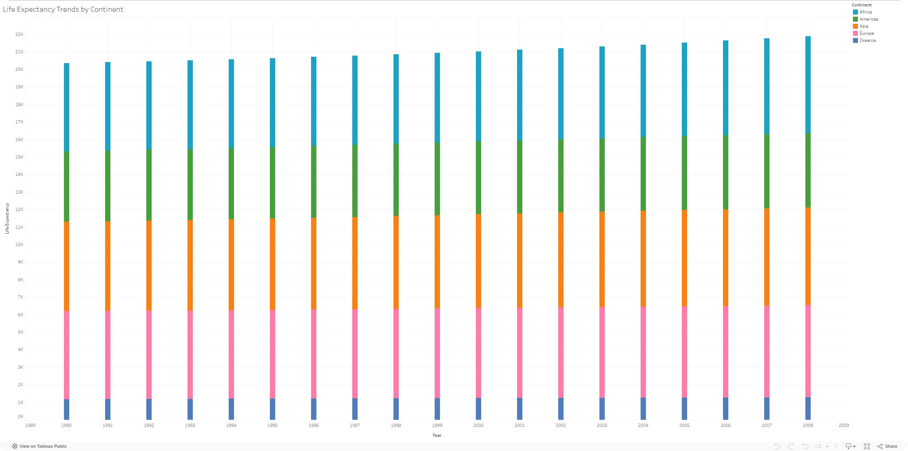

---

### Extra Visual 3 — BMI and Life Expectancy with Trend Line

An enhanced scatter plot comparing average BMI against average life expectancy by country, with a linear trend line added to reveal the overall correlation and notable outliers (e.g. Sierra Leone).

**What I did:**
- Dragged `BMI` to Columns and `Life Expectancy` to Rows (both set to Average)
- Changed mark type to Circle
- Added `Country` to Detail and `Continent` to Colour
- Added a linear trend line via the Analytics tab (drag Trend Line → Linear)
- Set view to Fit Entire View

**Screenshot**
> 📸 *Navigate to the BMI and Life Expectancy scatter plot worksheet. Capture the full chart showing the scatter of country dots, the linear trend line running diagonally through the data, and the Continent colour legend. Outlier countries (particularly in the bottom-left, low BMI and low life expectancy cluster) should be visible. The trend line should be clearly distinct from the data points.*


---

### Extra Visual 4 — Total Cancer Rate by Country

Created a calculated field combining Liver, Lung, and Stomach Cancer rates into a single `Total Cancer Rate` metric, then built a horizontal bar chart sorted descending to identify countries with the highest combined cancer burden.

**Calculated field used:**
```
[Liver Cancer] + [Lung Cancer] + [Stomach Cancer]
```

**What I did:**
- Created a calculated field `Total Cancer Rate` via Analysis → Create Calculated Field
- Dragged `Country` to Rows and `Total Cancer Rate` to Columns
- Applied `Continent` to Colour
- Sorted descending to rank countries from highest to lowest cancer rate

**Screenshot**
> 📸 *Navigate to the Cancer Rates worksheet. Capture the full bar chart with countries on the Y-axis (sorted descending — highest cancer rate at the top) and Total Cancer Rate on the X-axis. The Continent colour legend should be visible. The top 10–15 countries should be clearly readable on screen — scroll if needed and take a second screenshot showing the bottom of the chart, or capture the full view if it fits.*


---

### Extra Visual 5 — Population Growth by Continent Over Time

A line chart showing population growth trends per continent from 1990 to 2008, revealing which regions are growing fastest and how that growth has shifted over time.

**What I did:**
- Dragged `Year` to Columns and `Population Growth` to Rows
- Applied `Continent` to Colour
- Changed mark type to Line

**Screenshot**
> 📸 *Navigate to the Population Growth worksheet. Capture the full line chart with years on the X-axis (1990–2008) and population growth values on the Y-axis. Each continent should appear as a distinct coloured line. Africa should be visible as the highest line throughout. The Continent colour legend should be visible on the right.*


---

### Extra Visual 6 — Gender Health Overview (Small Multiples Bar Chart, 2008)

A bar chart showing average life expectancy broken down by country and gender for the year 2008, coloured by continent and enhanced with average BMI as an additional detail mark.

**What I did:**
- Added `Gender` to Columns and `Country` + `Life Expectancy` (Average) to Rows
- Changed mark type to Bar
- Added `Continent` to Colour
- Added `BMI` (Average) to the Marks card as additional detail
- Filtered `Year` to 2008 (converted Year to Discrete first)
- Edited axis title for clarity

**Screenshot**
> 📸 *Navigate to the Gender Health Overview worksheet. Capture the view showing multiple rows of bar charts — one per country — with two bars per country (one for each gender). The Continent colour legend should be visible on the right. The Year filter (2008) should be visible. Scroll to show a representative sample of 10–15 countries clearly.*


---

## 🎵 Project 2 — Spotify Music Trends & Popularity Analysis

**Dataset:** `SpotifyFeatures_-_xlsx_version.xlsx`  
**File:** [`SpotifyFeatures_-_xlsx_version.xlsx`](./SpotifyFeatures_-_xlsx_version.xlsx)  
**Live Dashboard:** [🔗 View on Tableau Public](https://public.tableau.com/app/profile/chanveer.grewal/viz/SpotifyMusicTrends_17739383003100/SpotifyDashboard)

### About the Dataset

A Spotify track-level dataset containing audio feature measurements for thousands of songs across multiple genres. Key fields include: `genre`, `artist_name`, `track_name`, `popularity` (0–100 scale), `acousticness`, `danceability`, `energy`, `instrumentalness`, `liveness`, `loudness`, `speechiness`, `tempo`, `valence`, and `duration_ms`. Each field is a numerical Spotify-calculated metric describing an audio characteristic of the track.

> **In my own words:** This dataset gives a detailed audio fingerprint for thousands of tracks, letting an analyst explore what musical characteristics drive popularity — exactly the kind of insight a streaming platform, record label, or music producer would want before investing in new artists or playlists.

### Real-World Context

**Organisation type:** Music streaming platform, record label, talent agency, or digital marketing company  
Understanding which genres and audio characteristics correlate with high popularity helps a business like Spotify decide which genres to promote, helps labels understand what a hit record sounds like in data, and helps artists make more informed creative decisions about their music.

---

### Visual 1 — Number of Songs by Genre

A bar chart showing how many tracks appear in the dataset for each genre, giving a sense of which genres are most represented.

**What I did:**
- Dragged `Genre` to Rows and `Track Name` (Count) to Columns
- Sorted descending to rank genres by volume

**Screenshot**
> 📸 *Navigate to the Number of Songs by Genre worksheet. Capture the horizontal bar chart with genres listed on the Y-axis and track count on the X-axis, sorted from highest to lowest. All genre labels should be readable. The chart title should be visible at the top.*

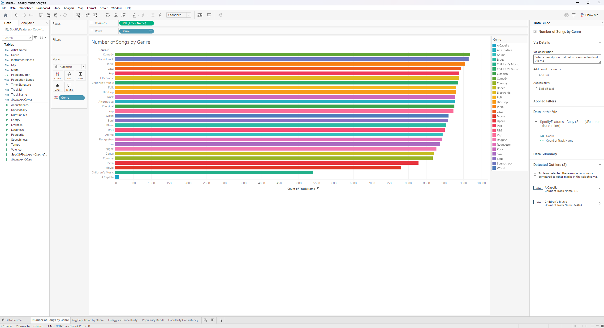

---

### Visual 2 — Average Popularity by Genre

A bar chart comparing the average popularity score (0–100) across all genres, revealing which genres tend to produce the most-listened-to tracks.

**What I did:**
- Dragged `Genre` to Rows and `Popularity` (Average) to Columns
- Applied colour to highlight the spread between high and low popularity genres
- Sorted descending

**Screenshot**
> 📸 *Navigate to the Average Popularity by Genre worksheet. Capture the horizontal bar chart showing genres on the Y-axis and average popularity score on the X-axis (0–100 scale). The highest-performing genres (Pop, Rap, Rock) should appear at the top. Colour differences between bars should be visible. The chart title should be readable.*

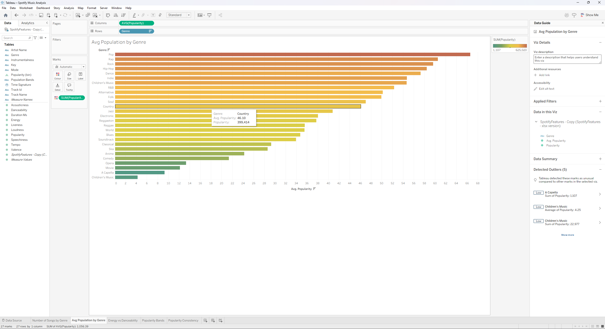

---

### Visual 3 — Energy vs Danceability (Scatter Plot)

A scatter plot exploring the relationship between a track's energy level and its danceability score, to test whether more energetic songs tend to be more danceable.

**What I did:**
- Dragged `Energy` to Columns and `Danceability` to Rows
- Added `Genre` to Colour to see if the relationship holds across different music types
- Applied a trend line (Analytics tab → Linear Trend Line)

**Screenshot**
> 📸 *Navigate to the Energy vs Danceability worksheet. Capture the full scatter plot showing the distribution of tracks, with energy on the X-axis and danceability on the Y-axis. The linear trend line should be clearly visible running through the data. The Genre colour legend should be visible on the right. The positive correlation (dots trending upward from left to right) should be visually apparent.*

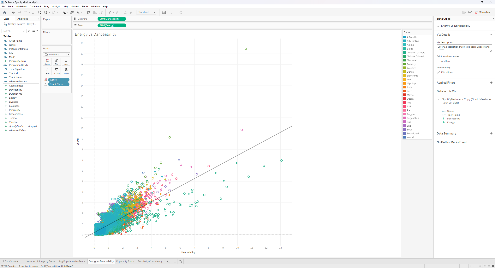

---

### Visual 4 — Popularity Bands

A visualisation grouping tracks into popularity band categories (e.g. Low, Medium, High) to show what proportion of songs fall into each tier across the dataset.

**What I did:**
- Created a calculated field or bin to segment the `Popularity` score into bands
- Visualised the distribution to show the concentration of tracks in the medium popularity range

**Screenshot**
> 📸 *Navigate to the Popularity Bands worksheet. Capture the chart showing popularity band categories (e.g. Low / Medium / High or numerical bands) on one axis and the count or proportion of tracks on the other. It should be clearly visible that the majority of tracks fall into the medium range (~70% of all tracks). Labels or percentage annotations should be visible if applied.*

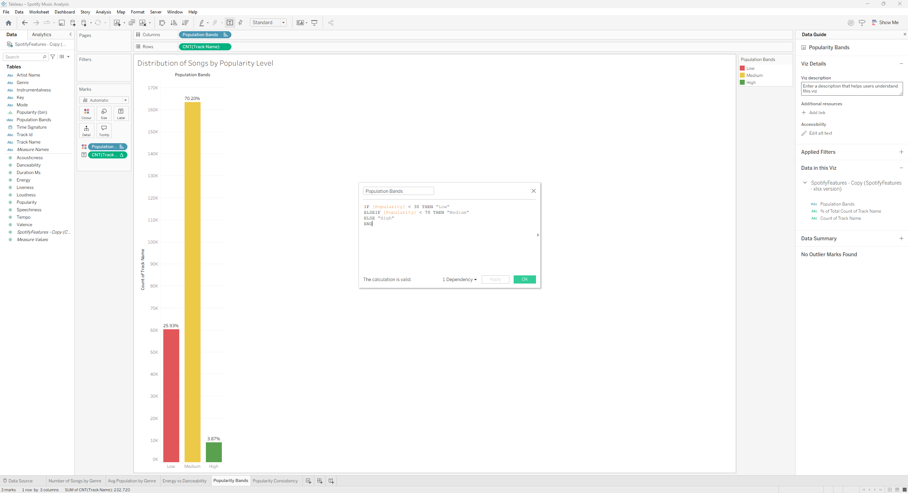

---

### Visual 5 — Popularity Consistency by Track Name and Genre

A visualisation showing the spread (range) of popularity scores for individual tracks or genre groupings — highlighting which genres produce consistently popular music vs. those with highly variable results.

**What I did:**
- Used `Track Name` and `Genre` as dimensions
- Plotted popularity range or distribution to reveal consistency vs. variability

**Screenshot**
> 📸 *Navigate to the Popularity Consistency worksheet. Capture the chart showing genres or tracks on one axis and their popularity spread on the other. Genres with tight clusters of popularity scores (consistent performers) should be visually distinct from those with a wide spread (unpredictable results). Genre labels should be readable.*

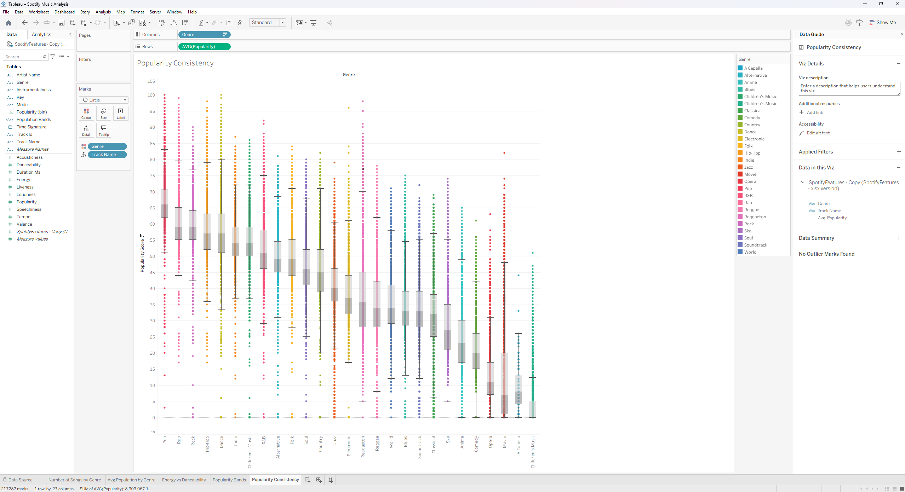

---

### Dashboard — Spotify Music Trends & Popularity Analysis

**Dashboard name:** `Spotify Dashboard`

Combined all five Spotify worksheets into a single interactive dashboard giving a holistic view of genre performance, audio characteristics, and popularity patterns.

**Screenshot**
> 📸 *Navigate to the `Spotify Dashboard` tab. Capture the complete dashboard showing all visuals arranged together — genre breakdown, popularity by genre, scatter plot, bands, and consistency charts. Any interactive filters should be visible. The dashboard title "Spotify Music Trends & Popularity Analysis" should be readable at the top.*

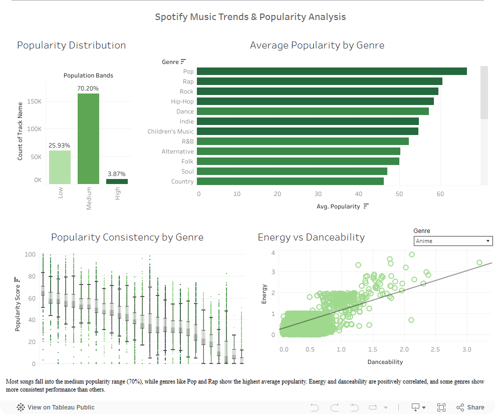

---

### Findings

> *Most songs fall into the medium popularity range (around 70%), showing that the majority of tracks perform at an average level. Genres like Pop, Rap and Rock have the highest average popularity. The relationship between energy and danceability shows a clear positive trend — more energetic songs are generally more danceable, which may contribute to their success. Some genres show tight popularity ranges (consistent performers), while others have wide spreads, meaning their success is less predictable and more track-dependent.*

**What this means for the business:** A streaming platform or label can use this analysis to understand which genres are reliable performers vs. which are hit-or-miss. The energy/danceability relationship suggests that investing in high-energy genres may correlate with stronger streaming numbers — a useful signal for playlist curation and A&R decisions.

**Live Dashboard:** [🔗 Spotify Music Trends Dashboard on Tableau Public](https://public.tableau.com/app/profile/chanveer.grewal/viz/SpotifyMusicTrends_17739383003100/SpotifyDashboard)

---

## 🛠️ Tools & Techniques Used

- **Tableau Public Desktop** — primary visualisation and dashboard tool
- **Chart types:** Bar, Horizontal Bar, Line, Pie, Scatter, Filled Map, Stacked Bar
- **Features:** Filters (Top N, discrete year, country), Colour marks, Size marks, Detail marks, Labels, Trend Lines (Linear), Calculated Fields, Fixed Axis Ranges, Pages shelf (animation)
- **Calculated fields:** `Total Cancer Rate = [Liver Cancer] + [Lung Cancer] + [Stomach Cancer]`
- **Published to:** Tableau Public

---

## 📂 Datasets

| File | Description | Source |
|------|-------------|--------|
| `GapminderHealth.xlsx` | ~6,000 global health records across countries, years, and genders | Bootcamp (Gapminder Foundation) |
| `SpotifyFeatures_-_xlsx_version.xlsx` | Track-level Spotify audio features and popularity scores | Bootcamp (Kaggle) |

---

*← [Back to Portfolio](https://github.com/chansg/chansg)*
